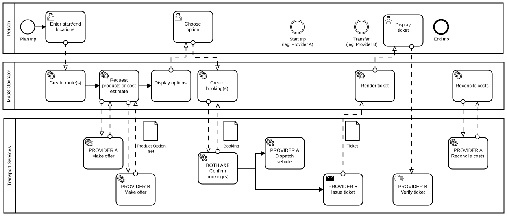

# MaaS Overview

Mobility as a Service is **built on the principle of service**. In our context, service means **meeting human needs**. We also have a commitment to **offer quality and promote sustainability.**

We are stewards of the social, technical, and environmental aspects of human mobility.

## Definitions

Many definitions of MaaS and the various stakeholders exist. For clarity we use the definitions below:

#### Transportation Service Provider \(TSP\)

A Transportation Service Providers offers a -most often- physical mobility solution in the form of busses, shared vehicles, taxi service, ridesharing,... 

#### Mobility Integrator

A Mobility integrator combines information from various sources but...

#### MaaS Provider

## Technical overview

In order for MaaS to become reality, we need layers of technical infrastructure to support single- or multi-modal journies that span cities, regions, nations, continents, and possibly the globe. In other words, **we cannot work in isolation**.

By way of example, consider the following diagram showing some of the technical layers and data interchange needed to support a person when taking a multi-modal trip:

In the above abstraction, we can see there are many moving parts involved in efficient trip planning. execution, and reconciliation.

