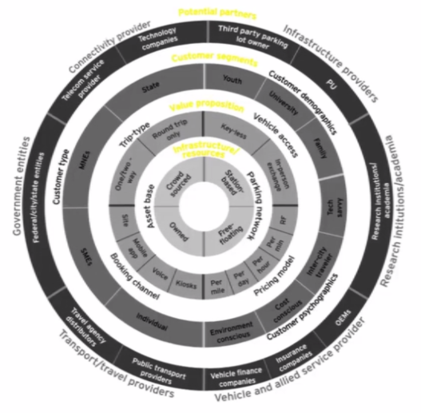

# Introduction

This section of the book contains information relevant to a **Transportation Service Provider**, in the context of **Mobility as a Service**. Many of the concepts and sections are likely familiar to transportation practioners, but are included in an effort to provide an holistic description of transportation concepts that are necessary to support Mobility as a Service. 

TSPs can have various compositions as illustrated by the image above.

| Infrastructure | Parking | Station-based |
| :--- | :--- | :--- |
|  |  | Free Floating |
|  | Asset base | Owned |
|  |  | Crowded Sourced |
|  |  | Private-Public |
| Value Proposition | Vehicle Access | Key-less |
|  |  | In Person Exchange |
|  |  | Mobile Phone |
|  |  | RFID Card |
|  | Pricing Model | Per distance |
|  |  | Per day |
|  |  | Per hour |
|  |  | Per min |
|  |  | Other |
|  | Booking Channel | Site |
|  |  | Mobile app |
|  |  | Voice |
|  |  | Kiosks |
|  |  | Third Party |
|  | Trip-Type | One way |
|  |  | Round Trip |
|  |  | Two way |
| Customer Segments | Customer Demographic | Youth |
|  |  | University |
|  |  | Familie |
|  |  | Senior |
|  |  | Special needs |
|  | Customer Psychographics | Environment conscious |
|  |  | Cost conscious |
|  |  | Inter-city traveler |
|  |  | Tech-savvy |
|  | Customer Type | Individual Private |
|  |  | Individual Professional |
|  |  | SMEs |
|  |  | MNEs |
|  |  | State |
| Potential Partners | Infrastructure Providers | Third party parking lot owner |
|  |  | PU |
|  | Research/Acaemi | University |
|  |  | Inn. startup |
|  | Service Providers | OEMS |
|  |  | Insurance Companies |
|  |  | Vehicle finance companies |
|  | Transport/travel providers | Shared Mobility |
|  |  | Public Transport |
|  |  | Travel Agency distributors |
|  |  | Private Provider |
|  | Government Entities | City |
|  |  | Region |
|  |  | State |
|  |  | Country |
|  | Connectivity Provider | Telecom Provider |
|  |  | Technology Companies |
|  | Other | ... |

